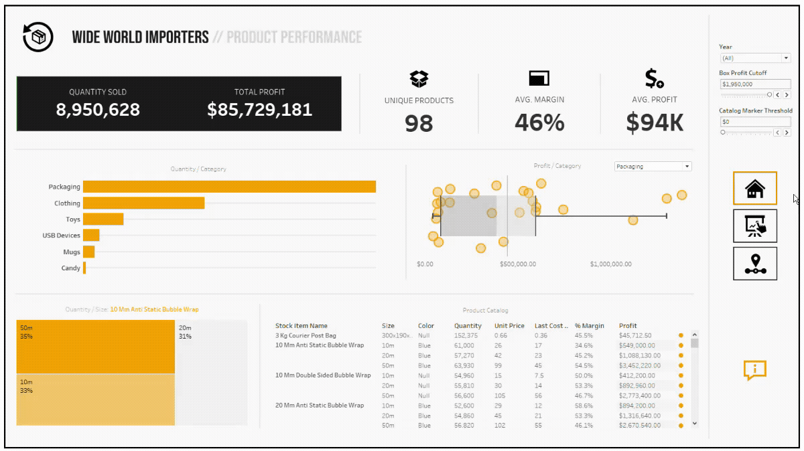

# Wide-World-Importers-Product-Analysis

### Hey! I'm Andrew. Welcome to my [Github] 👋

- 📊 Data visualization is my forte. See my [Tableau] page! 
- 🚀 Most of what you see here is Tableau, Python, and Figma
- 🧠 I'm interested in how our social climate and media trends influence marketing needs
- ⛳ A nice quote: "If it's worth doing, it's worth doing well"

## Wide World Importers
**WWI is a wholesale novelty goods importer and distributor operating from the San Francisco bay area**
 
 
 This is a sample [database] for Microsoft SQL 

This readme includes various screenshots, but you can view the actual dashboard [here].

## Approach
1. Python was used to clean two datasets ('steam' and 'games') which both contained various measures of video game data. There were many inconsistencies in game titles which could not have been cleaned without heavily relying on regex. Lambda functions were preferred.
2. Throughout the cleaning process, a few original functions were written and used repeatedly to monitor the effectiveness of NaN removal strategies.
3. Once the original data was cleaned, it was then merged via a right join from 'games' to 'steam.' The new 'biggames' dataframe was passed through a .melt function to restructure it  for use in Tableau.
4. The dashboard's background/style was designed in Figma then built in Tableau.

## Dashboard Highlights

**The Platform/Genre Bar Graph** 

- This graph was achieved with a combined field (platform & genre) bar graph on a dual axis with a shapes graph (the controller icons)
- Each shade of blue details a different genre within each platform, ordered by # of sales. 
- Tooltips can be accessed by hovering. Controller icons display similar platform stats (excluding genres)
- Parameters can then be used to filter the data by Release Year or Region. Nearly every graph and table in the dashboard can be filtered by these parameters.

**Overlapping Circle Viz** 

- Visualizations like this can be made in Tableau with an intricate tweaking of calculated fields. For example, here's a window into my columns and rows pills:
 
    **Columns:** SIN([Index -1]\*PI()/180)\*[TC Value]
     
    **Rows:** COS([Index -1]\*PI()/180)\*([TC Value])+([TC Value])
     
- While there are many things that Tableau *can* be used for, some things are better off created in another program like Figma. The overlapping circle graph is one of those things. Building it in Tableau was less than intuitive, but it's important to note that the circles **are** proportional to each subgroup's sales totals.
- In conclusion, tackling juxtaposition with this type of visualization turned out to be a great choice. I'm very satisfied with the result.

**Publisher Bubble Chart**

The most successful Publishers found their niches within specific genres and were able to corner a large portion of the market by doing so. We know that Nintendo is world-famous for their first-party platformer franchise (Mario), and EA has been the go-to for sports games for many years (FIFA, Madden). How do Publishers' #1 genres compare to their priorities?

## Data Insights

- **Wii Sports** earned its place as the #1 best-selling title. While other platforms focused efforts on online, multiplayer, multiplatform franchises, Nintendo doubled down on local multiplayer with its groundbreaking motion-activated IPs. *(see Platforms)*

- **Deep Pockets:** The hyper-portable Nintendo DS became the perfect addition to Japan's on-the-go pedestrian communities, made-official by its status as their most successful platform. *(see Subgroups)*

- **Franchise Families:** Mario, Pokémon, Call of Duty, and Grand Theft Auto have all become household names. These franchises have transcended generations for decades, and are largely responsible for the success of their platforms. *(see Subgroups)*

- **Publisher Priorities:** The top 3 publishers (Nintendo, EA, Activition) dominated the markets for their own respective genres (Platformer, Sports, Shooter). Each of these genres became each publisher's #1 genre by a longshot. *(see Publishers)*

- **The Shift in Shooters:** The steep upward trend in the Shooter  genre is consistent across all regions and spans multiple decades, until decreasing steadily around the late 2010s. Upon closer inspection, this downward trend is apparent across all genres. Can we consider it to be a limitation of our dataset, lacking a breadth of titles in more recent years, or is it an accurate depiction of the gaming industry as a whole? *(see Regions)*

### Looking Back

- 'games' was over twice the size of 'steam', but had much less integrity (NaN %, inconsistent Title formatting)
- 'steam' was pleasant to work with, and was prioritized for its sales data
- To avoid disturbing the accuracy of global rankings, I decided against dropping biggames titles with NaN Publisher values
- The amount of overlap between 'games' and 'steam' was almost negligible, and had I discerned that early on in the project, I may not have approached the datasets with the regex and merges in the way that I did -- Noted!

### Moving Forward

These datasets didn't include the measures necessary for a financial analysis. In the future, I'd like to work with a dataset that provides insight into how publishers prioritize budgets for certain franchises with regards to their profit margins. With the proper data, I'd like to see tiered lists for publishers and their respective franchises. 

Nintendo's Tier 1 would surely include the Mario franchise. How would other franchises like Kirby, Metroid, Zelda, etc. rank?)

## See the complete interactive dashboard [here]

[Tableau]: https://public.tableau.com/app/profile/andrew.bruening
[Github]: https://github.com/andrewbruening
[here]: https://public.tableau.com/views/WideWorldImportersProductAnalysis/HomeDash?:language=en-US&publish=yes&:display_count=n&:origin=viz_share_link
[database]: https://docs.microsoft.com/en-us/sql/samples/wide-world-importers-what-is?view=sql-server-ver15